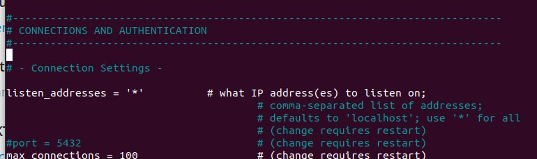
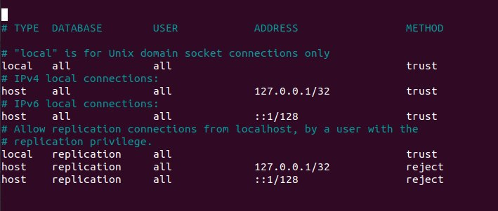

Jos olet asentanut PostgreSQL:n Linuxiin käyttäen asennusskriptiä, joka on tehty tätä kurssia varten.
Saatat törmätä seuraavan kaltaisiin [**virhetulostuksiin**](./virheilmoitukset.md)

Kokeile psql configin modifikaatiota:
[Stack Overflow: linkki ongelman ratkaisuehdotukseen](https://stackoverflow.com/a/50919900)
<br>

```bash
nano /home/kayttajanimi/pgsql/data/postgresql.conf:
```


jossa **listen_addresses** oli ='' ja muutettu '\*'

seuraavaksi:

```bash
nano /home/luee/pgsql/data/pg_hba.conf
```


I**Pv6 ja IPv4** on **reject**, muuta **trust**

kun yllä olevat modifikaaiot on tehty:

1.  erillisessä terminaali ikkunassa:

```bash
   start-pg.sh
```

2.

```bash
   psql -d postgres -f ./scripts/initdb.sql
```

3.

```bash
   flask run
```
